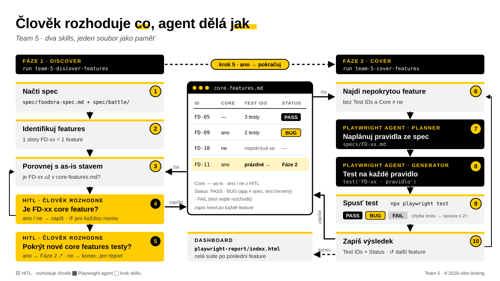

# Team 5 · Demo workflow

Dvě fáze, dva skills, jeden soubor jako paměť: `teams/team-5/core-features.md`.

1. **Discover** (`run team-5-discover-features`) — ze spec vytáhne features, porovná je s as-is stavem
   a u každé nové rozhodne člověk, jestli je to core feature.
2. **Cover** (`run team-5-cover-features`) — každou feature bez linkovaných testů pokryje: planner → generator → běh.

Člověk rozhoduje, **co** je core feature. Agent dělá, **jak** ji pokrýt.

## Celý flow

Kroky 1–5 = Fáze 1, 6–10 = Fáze 2. Žlutě HITL, černě Playwright agenti, uprostřed `core-features.md`.

## `core-features.md` — co v něm workflow čte a zapisuje

| ID | Feature | Core | Test IDs | Status | Poslední běh |
| --- | --- | --- | --- | --- | --- |
| FD-05 | Cart | — | `FD-05 · …`, `FD-05 · …` | PASS | 2026-09-24 14:12 |
| FD-09 | *(z `spec/battle/`)* | ano | | | |
| FD-10 | *(z `spec/battle/`)* | ne | | | |

- **Core:** `—` = byla v as-is stavu · `ano` / `ne` = HITL rozhodnutí, jestli je to core feature. Řádek `ne` fáze 1 příště přeskočí a fáze 2 nepokrývá.
- **Test IDs:** prázdné = nepokryté → fáze 2 na ně pustí planner a generator.
- **Status:** PASS · BUG (app odporuje spec, test zůstává červený) · FAIL (test se nepodařilo rozchodit) · SKIPPED.

## Pravidla, která drží Accuracy

- Expected výsledek je vždy ze spec, nikdy z app. Healer ve smyčce není.
- Jeden test na pravidlo, název začíná `FD-xx ·`.
- Zápis do `core-features.md` hned po každé feature — přerušený běh nic neztratí.
- Druhý run na plně pokrytém souboru nic nového nevyrobí, jen pustí suite.

## Demo scénář (3 min)

Fáze 2 trvá ~4 min na feature, živě se do 3 minut nevejde. **Fázi 1 ukázat živě, fázi 2 pustit předem.**

| Čas | Co ukazujeme |
| --- | --- |
| 0:00 | Problém: spec se mění, jak poznat, co není pokryté? Diagram výše. |
| 0:30 | Živě `run team-5-discover-features`: najde FD-09 až FD-11, HITL dotaz, klik ano / ne. |
| 1:30 | Diff `core-features.md`: nové řádky, rozhodnutí, linkované Test IDs z předem puštěné fáze 2. |
| 2:15 | HTML report + jeden BUG řádek: citát ze spec vs. co app ukázala. |
| 2:45 | Pointa: člověk rozhoduje co, agent dělá jak — a skill funguje na jakoukoliv app se spec. |

## Otevřené otázky

| Otázka | Dopad | Kdo odpoví |
| --- | --- | --- |
| „Doplnit nové funkce“ na konci fáze 1 = spustit fázi 2 (jak je v diagramu), nebo ručně přidat features, které ve spec nejsou? | Buď se fáze navazují automaticky, nebo přibude další HITL krok na ruční zadání features. | Petr |
| HITL dotazy vs. pravidlo „runs cold“ (žádný další prompt)? | Porota může HITL brát jako porušení cold runu → horší Reusability. Varianta: bez odpovědi platí default `ano`. | Petr, případně organizátor |
